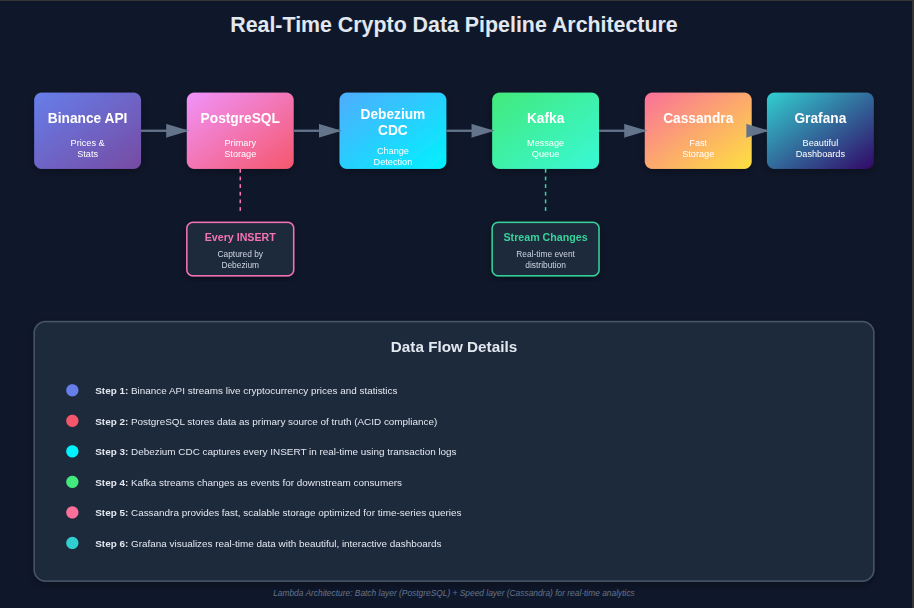
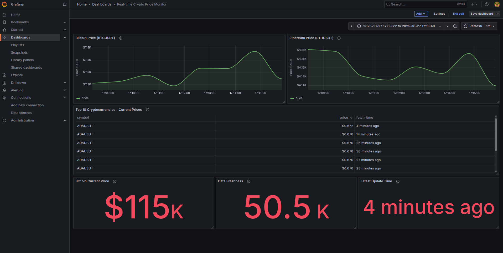
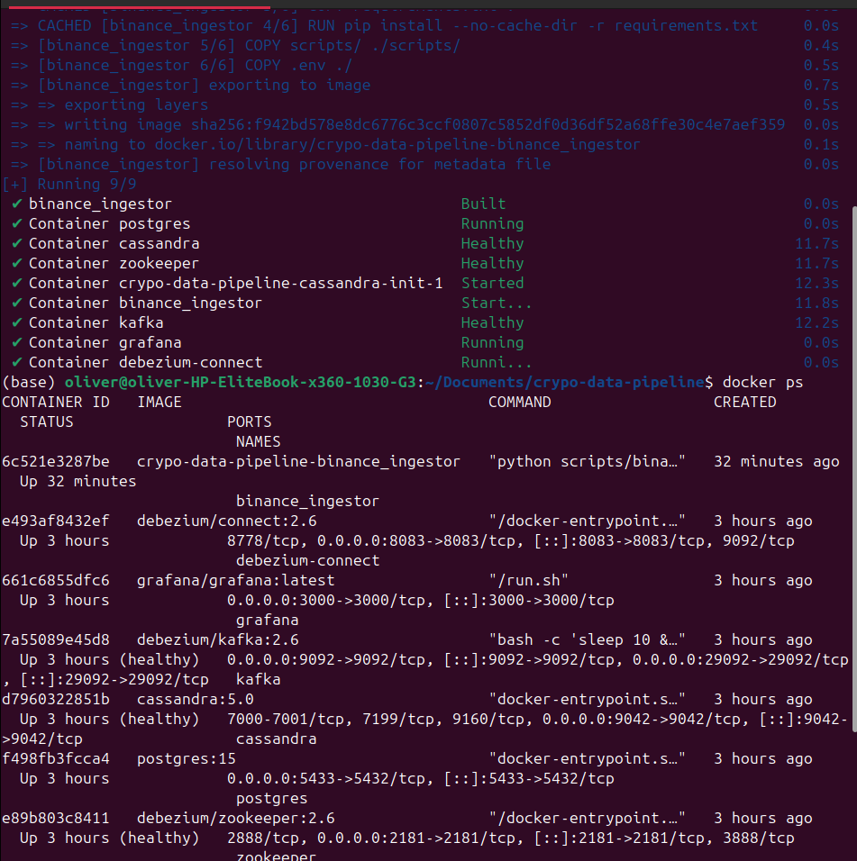
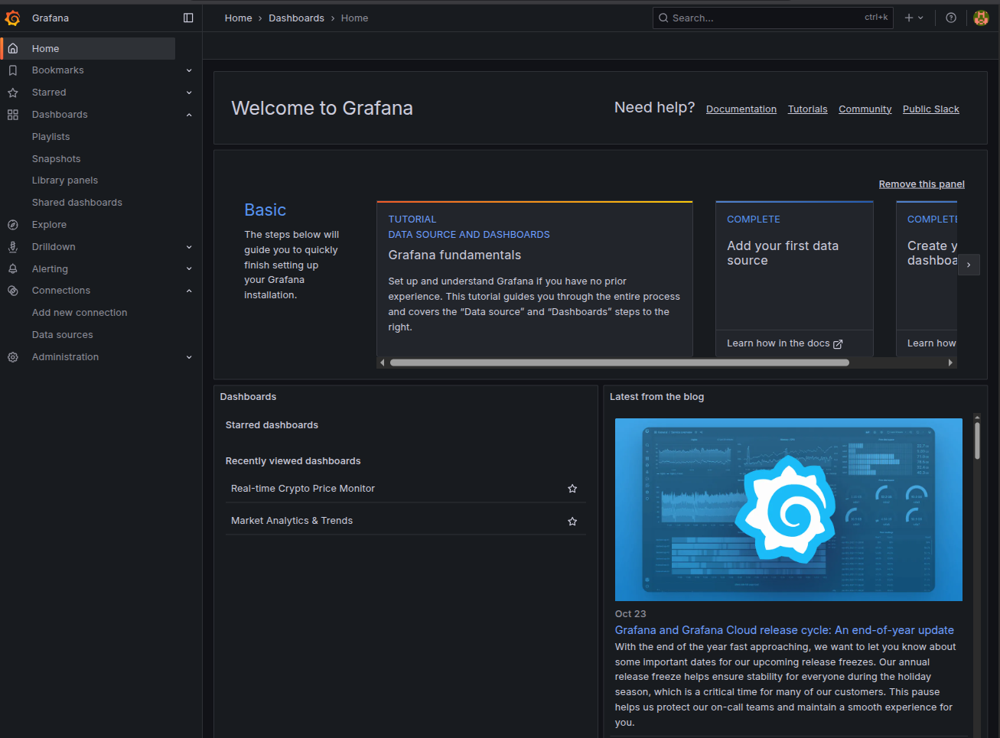
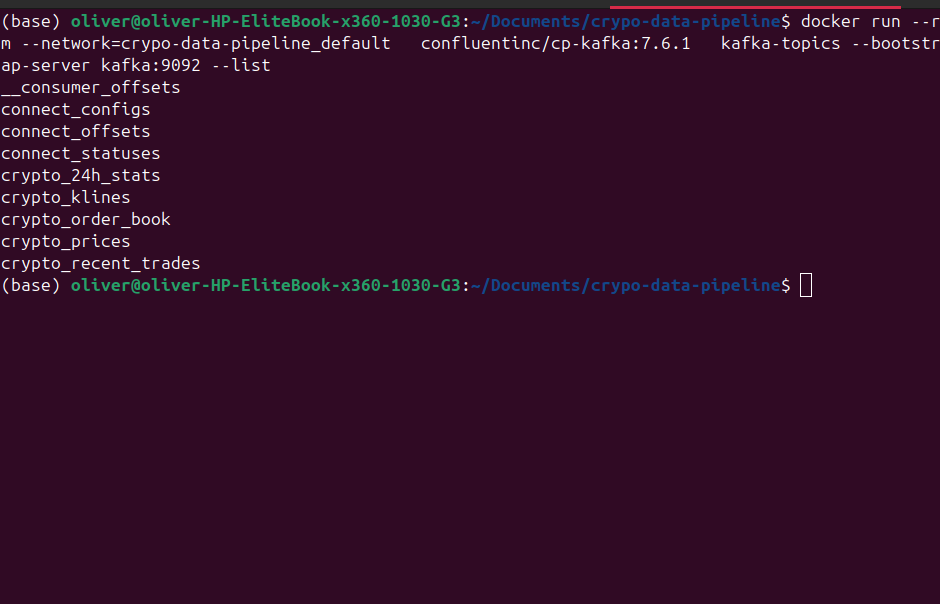
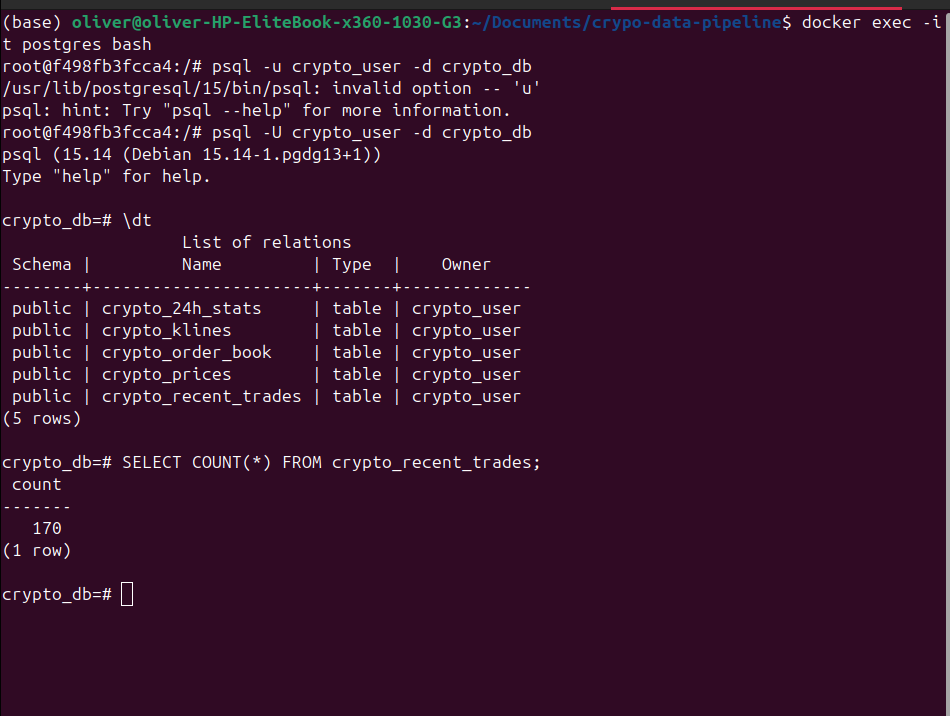
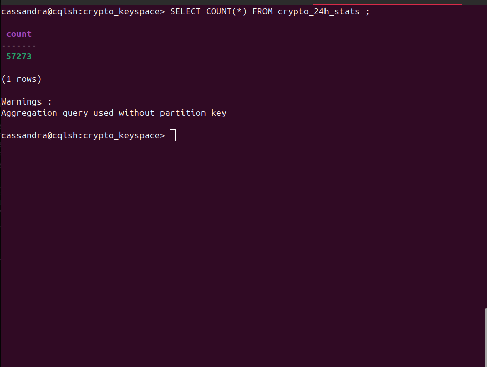
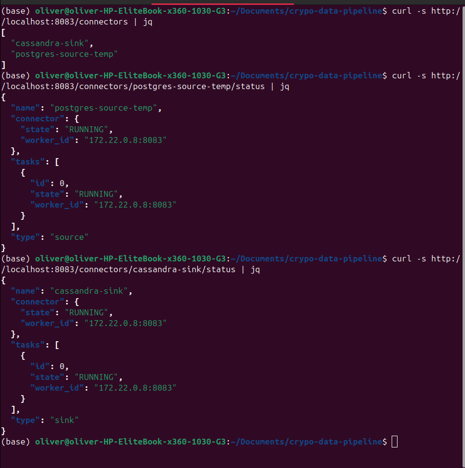
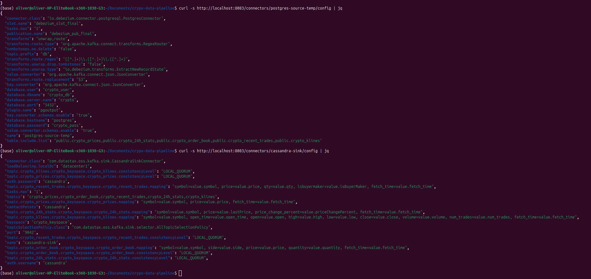
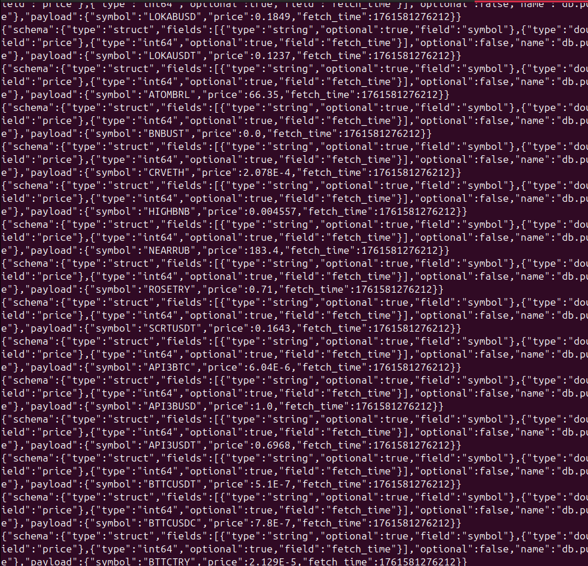

# Crypto Data Pipeline

Imagine watching the entire cryptocurrency market update live. Every price tick, every trade, every order, streaming seamlessly from **Binance → PostgreSQL → Kafka → Cassandra → Grafana**. This project turns that vision into reality, combining real-time data engineering, CDC, and beautiful visualizations into a single automated pipeline.

## What This Project Does

This project automatically collects cryptocurrency market data (prices, trading volumes, order books, and more) from Binance every 10 minute and displays it in real-time dashboards. Think of it as a Bloomberg Terminal, but for cryptocurrencies and fully automated.

## What We've Achieved

**Real-Time Data Collection**: Automatically fetches live crypto market data from Binance every 3600 seconds  
**Automated Data Pipeline**: Data flows seamlessly from Binance → PostgreSQL → Debezium CDC → Kafka → Cassandra without manual intervention  
**Change Data Capture (CDC)**: Allows this system to detect new data in PostgreSQL in realtime without polling. Instead of repeatedly querying the database, Debezium listens to changes directly through PostgreSQL's replication log, ensuring near-zero latency and minimal load.  
**Scalable Architecture**: Built with enterprise-grade technologies (Debezium, Kafka, Cassandra) that can handle millions of records  
**Beautiful Visualizations**: Ready-to-use Grafana dashboards for monitoring crypto markets

## Architecture Overview

```
Binance API → PostgreSQL → Debezium CDC → Kafka → Cassandra → Grafana
    ↓             ↓              ↓           ↓          ↓          ↓
  Prices      Primary      Change       Message    Fast      Beautiful
  Stats       Storage      Detection    Queue      Storage   Dashboards
                ↓                        ↓
          Every INSERT              Stream Changes
```
  
*End-to-end pipeline from data ingestion to visualization.*

### Components Breakdown

1. **Binance Data Collector** (Python)
   - Fetches 5 types of market data: prices, 24hr stats, order books, recent trades, and candlestick data
   - Writes data to PostgreSQL every 3600 seconds

2. **PostgreSQL Database**
   - Primary storage for all crypto market data
   - Stores historical data with timestamps
   - **Change Data Capture (CDC) enabled** via logical replication

3. **Debezium Change Data Capture**
   - Automatically detects and captures database changes in real-time
   - Monitors PostgreSQL for INSERT, UPDATE, DELETE operations
   - Converts database changes into Kafka messages
   - No impact on database performance

4. **Apache Kafka**
   - Kafka acts as a real-time buffer between Debezium and Cassandra, ensuring data reliability. If Cassandra goes down, no data is lost. Kafka stores all change events until Cassandra comes back online.

5. **Cassandra Sink Connector**
   - The Cassandra Sink Connector (Datastax) continuously listens to Kafka topics and mirrors every change into Cassandra table that match the PostgreSQL schema.

6. **Apache Cassandra**
   - Fast, distributed database optimized for time-series data
   - Powers our real-time dashboards
   - Stores denormalized data for quick reads

7. **Grafana Dashboards**
   - Visual interface for exploring crypto market data
   - Live charts and analytics

## Data We Collect

| Data Type | Description | Update Frequency |
|-----------|-------------|------------------|
| **Prices** | Latest price for all trading pairs | Every 3600 seconds |
| **24hr Stats** | Price changes, volumes, and market movements | Every 3600 seconds |
| **Order Books** | Current buy/sell orders | Every 3600 seconds |
| **Recent Trades** | Latest market transactions | Every 3600 seconds |
| **Candlesticks** | Historical price patterns (OHLCV) | Every 6000 seconds |

  
*Live dashboard displaying top-performing cryptocurrencies by 24h change.*

## Getting Started

### Prerequisites
- Docker and Docker Compose installed on your computer

### Quick Start (3 Steps)

1. **Create environment file**
   ```bash
   # Create a .env file with these contents:
   POSTGRES_USER=crypto_user
   POSTGRES_PASSWORD=crypto_pass
   POSTGRES_DB=crypto_db
   ```

2. **Start everything**
   ```bash
   docker compose up --build -d
   ```
     
   *Shows container orchestration success*

3. **View your dashboards**
   - Open `http://localhost:3000` in your browser
   - Login: admin / admin
   - Explore the crypto market data!



## Project Screenshots

### Architecture & Data Flow
  
  


## Configuration Files

- `docker-compose.yml` - Orchestrates all services
- `connectors/cassandra-sink.json` - Cassandra data sink configuration
- `connectors/postgres-source-temp.json` - PostgreSQL change data capture configuration
- `scripts/binance_ingestor.py` - Main data collection script

## Current Data Statistics

- **Total Records Collected**: Over 1.8 million rows
- **Active Tables**: 5 (prices, stats, order books, trades, candlesticks)
- **Update Frequency**: Every 60 seconds
- **Data Sources**: Binance REST API
- **Storage**: PostgreSQL (primary) + Cassandra (analytics)

## Grafana Dashboards

Our dashboards provide:
- **Real-time price monitoring** across all trading pairs
- **24-hour market analysis** with price changes and volumes
- **Order book depth** visualization
- **Trade history** with buy/sell indicators
- **Candlestick charts** for technical analysis

## Troubleshooting

### Check if services are running
```bash
docker ps
```

### View data in PostgreSQL
```bash
docker exec postgres psql -U crypto_user -d crypto_db -c "SELECT * FROM crypto_prices LIMIT 10;"
```

### View data in Cassandra
```bash
docker exec cassandra cqlsh -e "SELECT * FROM crypto_keyspace.crypto_prices LIMIT 10;"
```

### Check connector status
```bash
curl -sS http://localhost:8083/connectors | jq
```
  
  
*REST response of CDC pipeline configuration*



## Key Features

**Fully Automated** - Set it and forget it, data collects automatically  
**Real-Time** - New data every 3600 seconds  
**Rich Visualizations** - Beautiful Grafana dashboards out of the box  
**Reliable** - Built on proven enterprise technologies  
**Scalable** - Can handle millions of records effortlessly

## Learn More

This project demonstrates:
- **Change Data Capture (CDC)** with Debezium - automatically captures database changes
- **Real-time data streaming** with Apache Kafka - reliable message queuing
- **Time-series data storage** with Cassandra - optimized for analytics
- **Data visualization** with Grafana - beautiful dashboards
- **Microservices architecture** with Docker - containerized services

### How Change Data Capture Works

1. Python script inserts data into PostgreSQL every 3600 seconds
2. **Debezium connector** watches PostgreSQL for changes using logical replication
3. When new rows are inserted, Debezium captures them automatically
4. Changes are converted to JSON messages and sent to Kafka topics
5. Cassandra sink connector consumes these messages and writes to Cassandra
6. Result: **Zero manual intervention** - data flows automatically!

## Support

For questions or issues, please check the logs:
```bash
docker logs binance_ingestor
docker logs debezium-connect
```

---